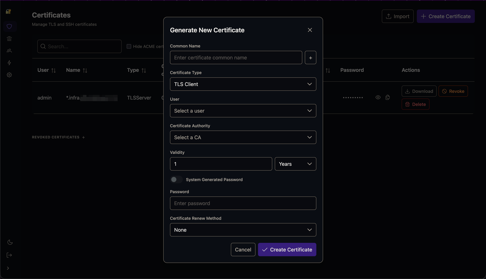
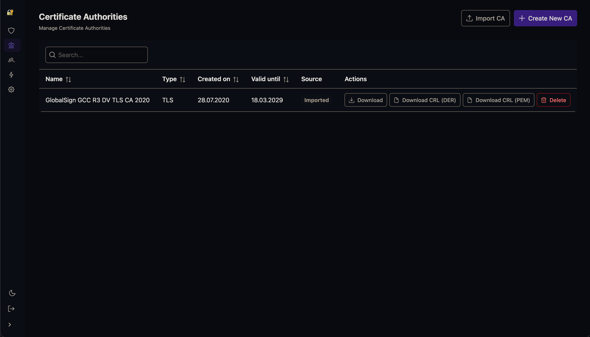
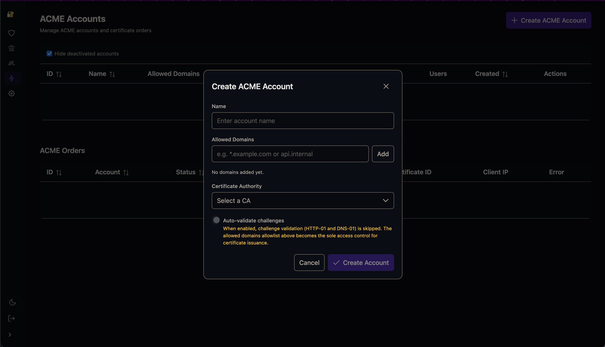

VaulTLS is a modern solution for managing mTLS (mutual TLS) certificates with ease.
It provides a centralized platform for generating, managing, and distributing TLS certificates for your home lab.

The main reason why I developed VaulTLS was that I didn't like messing with shell scripts and OpenSSL.
I also did not have an overview about the expiration of individual certificates.



## Features

- 🔒 Comprehensive TLS X.509 certificate management
- 📥 Import of externally purchased certificates with automatic CA chain import
- 💻 SSH certificate management
- 📱 Modern web interface for certificate management
- 🔐 OpenID Connect authentication support
- 📨 Email notifications for certificate expiration
- 🚀 RESTful API for automation
- 📦 Certbot-style agent (`vaultls-agent`) that auto-distributes certificates to Debian hosts ([details](api-client/README.md))
- 🤖 ACME CA support (Traefik, acme.sh, and other ACME clients)
- 🛠 Docker/Podman container support
- ☸️ Kubernetes deployment via Helm chart with optional S3 backup (restic)
- ⚡ Built with Rust (backend) and Vue.js (frontend) for performance and reliability

## Screenshots




## Installation
Installation is managed through a Container. The app should be behind a reverse proxy for TLS handling.
`VAULTLS_API_SECRET` is required and should be a 256-bit base64 encoded string (`openssl rand -base64 32`).
If you want to access VaulTLS using non-HTTPS you need to add the following environmental variable:
`VAULTLS_INSECURE=true`.

```bash
podman run -d \
  --name vaultls \
  -p 5173:80 \
  -v vaultls-data:/app/data \
  -e VAULTLS_API_SECRET="[VAULTLS_API_SECRET]" \
  -e VAULTLS_URL="https://vaultls.example.com/" \
  ghcr.io/vasyakrg/vaultls:latest
```

### Kubernetes (Helm)
For cluster deployments a Helm chart is provided under [`helm-chart/`](helm-chart/). It renders
the Deployment, Service, Ingress, persistent volume and an optional restic→S3 backup CronJob.

```bash
# 1. copy the prod values template and fill in secrets (kept out of git)
cp helm-chart/values.yaml helm-chart/values-prod.yaml

# 2. install / upgrade
helm upgrade --install vaultls ./helm-chart \
  -n vaultls --create-namespace \
  -f helm-chart/values-prod.yaml
```

`values-prod.yaml` is gitignored — never commit real secrets. Generate `apiSecret` / `dbSecret`
with `openssl rand -base64 32`. Keep `replicaCount: 1`: SQLite on an RWO volume does not tolerate
two writers. See [`helm-chart/values.yaml`](helm-chart/values.yaml) for all options.

### Encrypting the Database
By specifying the `VAULTLS_DB_SECRET` environmental variable, the database is encrypted. Data is retained. It is not possible to go back.

### Specifying log level
The default log level is moderate. If a different one is desired, please specify it using the `VAULTLS_LOG_LEVEL` environmental variable.
For bug reports, a trace or debug log report is desirable. Be aware logs can contain secrets. Please censor them before posting.
Available options are: `error`, `warn`, `info`, `debug` and `trace`.

### Setting up OIDC
To set up OIDC you need to create a new client in your authentication provider. For Authelia a configuration could look like this
```yaml
- client_id: "[client_id]"
  client_name: "vautls"
  client_secret: "[client_secret_hash]"
  public: false
  authorization_policy: "one_factor"
  pkce_challenge_method: "S256"
  redirect_uris:
    - "https://vaultls.example.com/api/auth/oidc/callback"
  scopes:
    - "openid"
    - "profile"
    - "email"
  userinfo_signed_response_alg: "none"
```
For VaulTLS the required variables can be configured via environmental variables or web UI.

| Environment Variable        | Value                                                |
|-----------------------------|------------------------------------------------------|
| `VAULTLS_OIDC_AUTH_URL`     | `https://auth.example.com`                           |
| `VAULTLS_OIDC_CALLBACK_URL` | `https://vaultls.example.com/api/auth/oidc/callback` |
| `VAULTLS_OIDC_ID`           | `[client_id]`                                        |
| `VAULTLS_OIDC_SECRET`       | `[client_secret]`                                    |

### Container Secrets
Certain environment variables can be container secrets instead of regular variables.
VaulTLS will try to read secrets from `/run/secrets/<ENV_NAME>`, if you want to specify a different path, you can do so in the environmental variable.
The following variables support secrets:
- `VAULTLS_API_SECRET`
- `VAULTLS_DB_SECRET`
- `VAULTLS_OIDC_SECRET`

## Usage
During the first setup a TLS Certificate Authority is automatically created. If OIDC is configured, no password needs to be set.
Users can either log in via password or OIDC. If a user first logs in via OIDC, their e-mail is matched with all VaulTLS users and linked.
If no user is found, a new one is created.

Users can only see certificates created for them. Only admins can create new certificates.
User certificates can be downloaded through the web interface.

The current CA certificate to be integrated with your reverse proxy is available as a file at `/app/data/ca/ca.cert`
and as download via the API endpoint `/api/certificates/ca/download` (the most recent TLS CA).
When you run multiple TLS CAs, use `/api/certificates/ca/bundle` instead — it returns all TLS CA
certificates as a single PEM, which is what a reverse proxy's trust pool needs. The public list of
all CAs (id, name, dates, type) is available at `/api/certificates/ca`, and a specific CA at
`/api/certificates/ca/<id>/download`.

Further API documentation is available at the endpoint `/api`

### TLS Certificate Passwords
Certificates downloaded come in the PKCS#12 file format. They are a bundle consisting of the public certificate and private key. By default, PKCS#12 passwords are optional and certificates will be generated with no password. On the settings page, the PKCS#12 password requirements can be set with the following options:

| PKCS12 Password Rule  | Result                                           |
|-----------------------|--------------------------------------------------|
| Optional              | Passwords are optional and can be blank          |
| Required              | Passwords are required, and can be user supplied |
| System Generated      | Random passwords will be generated               |

Passwords are stored in the database and retrieved from the web interface only when the user clicks on view password.

### TLS Server Certificates
VaulTLS also has support for server certificates.
The user flow remains quite similar with the difference that SAN DNS entries can be specified.
Download is also using a possibly password-protected PKCS#12 file.
Since most reverse proxies require the certificate and private key to be supplied separately, the PKCS#12 file may need to be split.
This can be done, for example, with openssl:
```sh
openssl pkcs12 -in INFILE.p12 -out OUTFILE.crt -nokeys
openssl pkcs12 -in INFILE.p12 -out OUTFILE.key -nodes -nocerts
```

### Certificate Revocation Lists (CRL)
TLS certificates cannot be simply deleted since their validity period is cryptographically encoded in the certificate. VaulTLS provides the CRL mechanism to revoke certificates. This file is used by the validation side (such as the server for client certificates) to check if the certificate has been revoked. CRLs are stored as files under `/app/data/crl/`. They can be downloaded in the CA tab of the frontend and can be retrieved from the API under `/api/certificates/ca/<id>/crl`. They do not require authentication to be accessed.

### SSH Certificates
VaulTLS also supports SSH certificates. To use these you must manually create a new SSH CA in the CA tab. Since SSH does not provide a bundled file format to store the private key and certificate, the file is provided as a ZIP archive.

### Caddy
To use caddy as a reverse proxy for the VaulTLS app, a configuration like the following is required.
```caddyfile
reverse_proxy 127.0.0.1:5173
```
To integrate the CA cert for client validation, you can either use a file or http based approach. Extend your TLS instruction for that with the client_auth section. Documentation here: [https://caddyserver.com/docs/caddyfile/directives/tls#client_auth](https://caddyserver.com/docs/caddyfile/directives/tls#client_auth).

File based:
```caddyfile
tls {
  client_auth {
    mode <usually verify_if_given OR require_and_verify>
    trust_pool file {
      pem_file <Path to VaulTLS Directory>/ca.cert
    }
  }
}
```

HTTP based:
```caddyfile
tls {
  client_auth {
    mode <usually verify_if_given OR require_and_verify>
    trust_pool http {
      endpoints <Address of VaulTLS Instance such as 127.0.0.1:5173>/api/certificates/ca/bundle
    }
  }
}
```

If you choose `verify_if_given`, you can still block clients for apps that you want to require client authentication:
```caddyfile
@blocked {
  vars {tls_client_subject} ""
}
abort @blocked
```

### ACME

VaulTLS can act as an ACME Certificate Authority, allowing clients like Traefik and acme.sh to automatically obtain certificates signed by your VaulTLS CA.

Enable it with `VAULTLS_ACME_ENABLED=true` and create an account in the ACME tab of the admin UI to get EAB credentials.

See the [ACME documentation](docs/acme.md) for full setup instructions including Traefik and acme.sh examples.

## Certificate Agent (`vaultls-agent`)

For Debian hosts that terminate TLS (nginx, HAProxy, Postfix, …) VaulTLS ships a
certbot-style agent that **pulls** certificates from the server and deploys them
locally — the deployment half of the PKI pipeline (VaulTLS issues; the agent distributes).

The agent runs as a systemd daemon, authenticates with a VaulTLS **service account**
(`cert:read` scope), and on a schedule:

- selects the right certificate (by name, wildcard-aware, or pinned `cert_id`),
- writes it to disk in `pem` and/or `haproxy` formats (private key always `0600`, atomic writes),
- reloads the target service **only when the certificate actually changed** (serial compare),
- exposes a built-in **Prometheus exporter** (`127.0.0.1:9105/metrics`) for expiry,
  reconcile/reload errors and update-availability, with ready-made alerting rules.

Install the `.deb` from [Releases](https://github.com/vasyakrg/VaulTLS/releases), then:

```bash
sudo vaultls-agent setup \
  --url https://vaultls.example.com \
  --client-id svc_xxxxxxxx --secret YOUR_SECRET \
  --domain "*.example.com" --reload "systemctl reload nginx"
```

📖 **Full documentation** (flags, config reference, output formats, metrics, alert rules,
build-from-source): [`api-client/README.md`](api-client/README.md).

## FAQ
### I can not login
Make sure you are accessing VaulTLS using a secure connection i.e. HTTPS. If you want to access VaulTLS insecurely you 
need to add the following environmental variable: `VAULTLS_INSECURE=true`.

### I (or a user) forgot my password
To change any users password specify the corresponding user's email address with the `VAULTLS_ACCOUNT_EMAIL` env variable and the new
password with `VAULTLS_ACCOUNT_PASSWORD`. During start up VaulTLS will check for these and if set, adjust the password and exit. You can not use
these env variables during normal operation and they need to be removed after the password was changed.

### OIDC is not working
If VaulTLS claims that OIDC is not configured, the most likely cause is that it couldn't discover the OIDC provider based on the `VAULTLS_OIDC_AUTH_URL` given. Make sure the VaulTLS container can access the OIDC provider. In general the base url to the auth provider should be enough. For Authentik the required URL path is `/application/o/<application slug>/`. If that doesn't work, directly specify the .well_known url.

## Mail is not working
Please make sure that you are choosing the correct email encryption type. Usually port 587 is for STARTTLS and 465 for TLS.

## Roadmap
- Allow user details to be updated
- Improve testing
